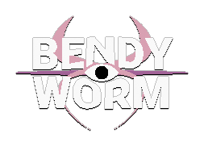

      
    
	 

BENDYWORM is a platformer with a twist: the entire world bends and twists around you as your progress through the level. Why? Because you're inside of a gigantic worm, and worms are bendy.

   

Play it here: https://bauxite.itch.io/bendyworm (Windows only for now)

The game is made for Github Game Off 2021.

[You can watch a video of the game here.](https://www.youtube.com/watch?v=74ADn0L7e9s)

----

## Controls

(note - only keyboard input prompts are shown in game; gamepad button prompts are missing but they still work)

| Keyboard | Gamepad | Action |
|---|---|---|
| **Arrow keys**  |  **Left Stick** or **DPad**  | Move |
| **Z** or **Space**  |  **A** (XBox) / **B** (Nintendo) |  Jump (hold to jump higher) |
| **X**  |  **X** (Xbox) / **Y** (Nintendo) | Shoot (hold to charge beam)  |
| **Enter** or **Space**|  **A** (XBox) / **B** (Nintendo) | Accept/Continue
| **Escape** | **START** | Open pause menu

## Building from source

If you want to build the game from source, read on.

The game is a Godot 3.3.3 project, so you can just [download Godot 3.3.3](https://godotengine.org/download) and open the project in the `godot` folder. The game requires a Rust submodule though, which needs to be compiled separately. Here's how:

1. Install [Rustup](https://rustup.rs/) 
2. Go to the `rust` folder in the project and run `cargo build --release` in the command line
3. After compilation finishes, copy the file `rust/target/release/bendyworm_rust.dll` to the `godot` folder. (TODO: this doesn't work yet on Linux, but on Linux the file will be called `bendyworm_rust.so`)

Now it should run.

## FAQ

### I want to run the game in windowed mode, not in fullscreen. How?
 
Press [ESC] to open the pause menu, then toggle "Fullscreen" to run the game in windowed mode.

### The game runs slowly. What to do?

In the main game, press [ESC] to open the pause menu. Then toggle "Fullscreen" to run the game in windowed mode, and reduce the size of the window. This makes the game run at a lower resolution, which should increase performance on lower-end GPUs.

Alternatively, if you want to play the game in fullscreen mode anyway, you can reduce your desktop resolution by right clicking the desktop and selecting "Display Settings" (e.g. if you're on a 1080p screen, you can drop down the resolution to 720p and it should run much faster)

### I beat the game and I want to replay it. How?

After watching the credits, enter the main game again, press [ESC] to open the pause menu, and then select "Delete Save and Start Over".

## Known issues

- Gamepad input prompts are missing, only keyboard input prompts are shown (see above for gamepad controls)

## Donate

If you like the game, consider buying me a coffee:

Additionally, you may enjoy [my previous game, Meteorite, as well](https://github.com/Bauxitedev/meteorite).

## License

MIT for the code, CC BY 3.0 for the assets. (attribute to `Bauxitedev` or one of the authors below, depending on assets used)

Attribution:

- [Brain 3D model by `kpaulsen` (CC BY 3.0)](https://opengameart.org/content/human-brain)
- [Godot Pixel Logo based on the work by `herrwoland` (CC0)](https://www.reddit.com/r/godot/comments/powk2y/so_i_made_a_better_pixel_logo_which_i_am_happy/)
- [Keyboard icons based on the work by `TRBRY` (CC BY 3.0)](https://opengameart.org/content/keyboard-keys)
- Some sounds used from Kenney's Retro Sound Pack (CC0)